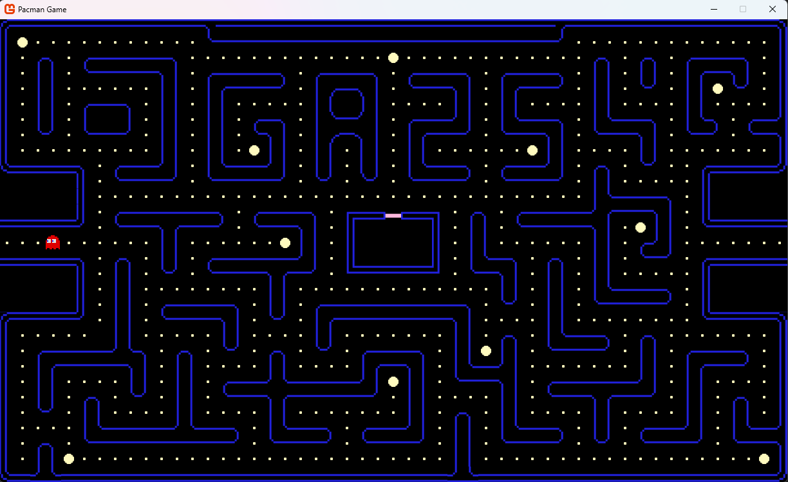

# Pacman-Ghost-Stealing-Protocol

An AI-enhanced Pacman game powered by FSM logic and A* pathfinding to enable intelligent ghost behavior. In this version, ghosts are no longer just chasing Pacman — they strategically steal power pellets in a predefined order, based on calculated shortest paths.


## Preview



## Features

- **AI Ghost Behavior**  
  Ghosts use a finite state machine (FSM) combined with A* pathfinding to steal power pellets, return home, and reach a goal.

- **Custom Tilemap Design**  
  A detailed 1200x720 tilemap featuring:
  - Navigable paths and static walls
  - Power pellets placed strategically across the map
  - Waypoints for `Home`, `Goal`, and each power pellet to support FSM transitions and A* routing

- **Waypoint System**  
  Ghosts interact only with designated waypoints (excluding Home and Goal) to execute their stealing protocol.


## Note
> If you see an error like this during the build process:
> 
> ```
> The command "dotnet mgcb /quiet /@:<path_to_Content.mgcb> ..." exited with code 1.
> ```
> 
> You can safely ignore it **if** the game still compiles and runs properly.  
> This error sometimes occurs due to non-critical issues with the MonoGame Content Builder (MGCB).  
